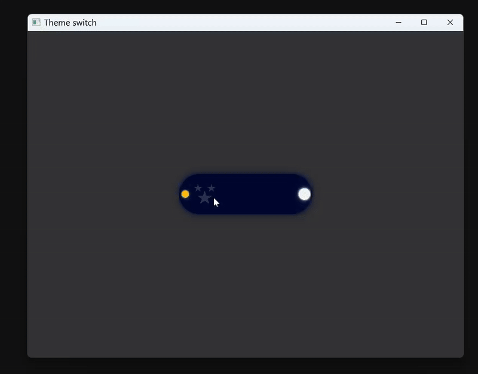

Qt Quick Theme Switch Button

A customizable Qt Quick Switch component that smoothly toggles between light and dark themes with sun, moon, cloud, and twinkling stars animations.

Features

Smooth sun and moon travel with easing

Cloud slide animation

Twinkling stars effect in dark mode

Adjustable colors and dimensions via properties

License
MIT License